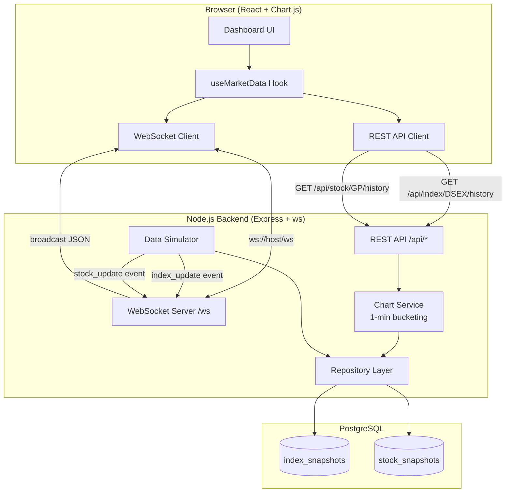

```mermaid
graph TD
    subgraph Browser["Browser (React + Chart.js)"]
        UI[Dashboard UI]
        Hook[useMarketData Hook]
        WS_Client[WebSocket Client]
        API_Client[REST API Client]
    end

    subgraph Backend["Node.js Backend (Express + ws)"]
        REST[REST API /api/*]
        WSServer[WebSocket Server /ws]
        Simulator[Data Simulator]
        ChartSvc[Chart Service<br/>1-min bucketing]
        Repo[Repository Layer]
    end

    subgraph DB["PostgreSQL"]
        IndexTbl[(index_snapshots)]
        StockTbl[(stock_snapshots)]
    end

    UI --> Hook
    Hook --> API_Client
    Hook --> WS_Client
    API_Client -->|GET /api/index/DSEX/history| REST
    API_Client -->|GET /api/stock/GP/history| REST
    WS_Client <-->|ws://host/ws| WSServer

    REST --> ChartSvc
    ChartSvc --> Repo
    Repo --> IndexTbl
    Repo --> StockTbl

    Simulator -->|index_update event| WSServer
    Simulator -->|stock_update event| WSServer
    Simulator --> Repo

    WSServer -->|broadcast JSON| WS_Client
```
